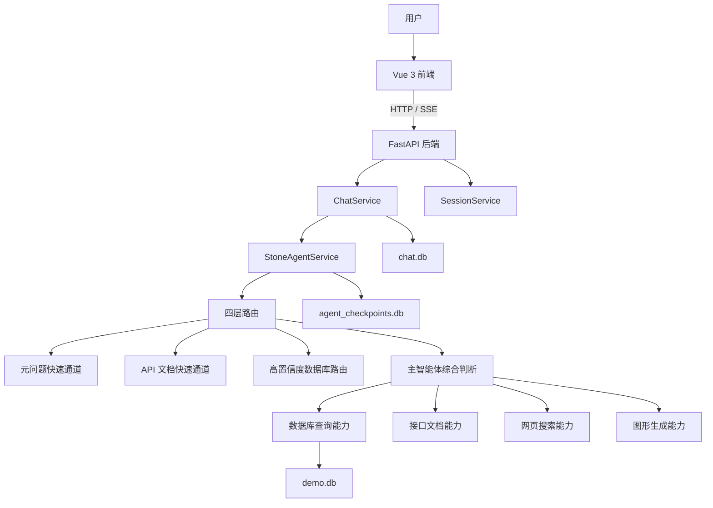

# 基于 LangGraph 的多智能体业务查询助手

**Multi-Agent Business Assistant**

这是一个面向业务查询场景的个人练习项目，基于 **Vue 3 + FastAPI + LangGraph / Deep Agents** 构建。  
项目重点不只是“让大模型回答问题”，而是尝试把自然语言请求拆分为不同类型，通过规则路由与智能体判断协同处理，再由数据库、接口文档、网页搜索和图形生成等能力完成任务。

我在这个项目中重点探索了以下问题：

- 如何让简单问题走稳定、低成本的确定性路径；
- 如何让复杂问题交给主智能体继续判断；
- 如何避免前端直接暴露内部推理、工具名称和提示词；
- 如何把 Agent、FastAPI、Vue、SQLite、SSE 串成完整工程链路；
- 如何为项目补充测试、Docker 部署和开源安全检查。

> 当前项目定位为个人练习与持续迭代项目，重点展示多智能体应用的工程设计与落地过程，不定位为企业级生产系统。

---

## 目录

- [项目截图](#项目截图)
- [项目思路](#项目思路)
- [核心功能](#核心功能)
- [技术栈](#技术栈)
- [系统架构](#系统架构)
- [四层路由设计](#四层路由设计)
- [关键工程设计](#关键工程设计)
- [数据与持久化](#数据与持久化)
- [本地运行](#本地运行)
- [Docker Compose 部署](#docker-compose-部署)
- [测试与验证](#测试与验证)
- [项目目录](#项目目录)
- [我的实现与迭代](#我的实现与迭代)
- [已知限制](#已知限制)
- [后续计划](#后续计划)
- [安全说明](#安全说明)

---

## 项目截图

截图统一放在 `docs/images/`：

- `docs/images/home.png`
- `docs/images/database-query.png`
- `docs/images/api-doc.png`
- `docs/images/diagram.png`

---

## 项目思路

传统的单 Agent 应用通常会把所有问题直接交给大模型判断。这样虽然实现简单，但也容易出现三个问题：

1. 简单问题仍然经过完整推理链路，响应慢、成本高；
2. 路由结果不稳定，同一个问题可能被分配到不同能力；
3. 前端容易直接展示内部推理和工具调用细节。

因此，我在这个项目中采用了“**规则优先、智能体兜底**”的思路：

- 对能够明确识别的问题，优先走快速通道；
- 对高置信度业务查询，直接进入对应能力；
- 对多意图、复杂或模糊问题，再交给主智能体综合判断；
- 对用户只展示安全的执行状态，不展示内部自由推理。

整个系统的核心不是单纯调用模型，而是通过路由、工具、状态管理和前后端交互，将模型能力组织成一套可运行的业务助手。

---

## 核心功能

### 1. 自然语言查询业务数据

支持对 SQLite 演示业务库进行自然语言查询，例如：

- 数据库中有哪些表；
- 查询前 5 条订单；
- 按客户统计订单数量；
- 查看商品和库存信息。

数据库能力会先读取表结构，再执行只读查询，降低错误 SQL 和越界操作风险。

### 2. REST API 文档检索

支持通过自然语言检索本地接口文档，例如：

- 查询某个接口的路径和方法；
- 查看请求参数；
- 查看响应结构；
- 根据接口描述寻找对应 API。

### 3. 网页信息搜索

支持将需要实时信息的问题路由到网页搜索能力，用于查询公开网页资料。

该能力依赖本地网络环境和第三方搜索服务可用性。

### 4. Graphviz DOT / 流程图生成

支持根据自然语言生成 Graphviz DOT 描述：

- 本地安装 Graphviz 时，可进一步渲染图片；
- 本地未安装 Graphviz 时，返回 DOT 源码；
- Docker 后端镜像中包含 Graphviz 依赖。

### 5. 多轮会话与状态持久化

- FastAPI 保存会话和聊天消息；
- LangGraph Checkpoint 保存 Agent 多轮状态；
- 前端支持会话切换和历史消息恢复。

### 6. SSE 流式输出

后端通过 SSE（Server-Sent Events，服务端事件流）持续向前端推送：

- 安全执行状态；
- 回答增量内容；
- 结构化 Trace；
- 最终完成事件。

---

## 技术栈

| 层级 | 技术 |
|---|---|
| 前端 | Vue 3、TypeScript、Vite、Element Plus |
| 后端 | Python 3.11、FastAPI、Pydantic、SQLAlchemy |
| Agent | LangGraph、Deep Agents |
| 数据与状态 | SQLite、LangGraph Checkpoint |
| 通信 | HTTP、SSE |
| 测试 | Pytest、Vitest |
| 部署 | Docker、Docker Compose、Nginx |
| 图形 | Graphviz |

---

## 系统架构



---

## 四层路由设计

四层路由是这个项目中最核心的设计之一。

我不希望所有问题都直接进入主智能体，因此将请求按“确定性”和“复杂度”划分为四层处理路径。

### 第一层：元问题快速通道

处理系统说明类问题，例如：

- 你能做什么；
- 有哪些能力；
- 介绍一下系统工作流程；
- 这个多智能体系统怎么工作。

这类问题不需要访问业务数据，也不需要调用复杂工具，因此直接返回根据能力注册信息生成的介绍。

设计目标：

- 减少不必要的模型调用；
- 提高响应速度；
- 保证系统介绍与真实能力一致；
- 避免回答中出现内部 Agent 名称和路由术语。

### 第二层：API 文档快速通道

处理目标明确的接口文档查询，例如：

- 查询 `get_users` 接口；
- 查看用户列表接口参数；
- 某个 API 的请求方式是什么。

这类问题直接检索本地 API 文档，不需要主智能体再次判断。

设计目标：

- 提高接口检索的确定性；
- 避免复杂推理造成答案漂移；
- 快速返回接口路径、方法、参数和响应结构。

### 第三层：高置信度数据库路由

处理明显属于业务数据查询的问题，例如：

- 数据库中有哪些表；
- 查询前 5 条订单；
- 查看商品库存；
- 统计客户订单数量。

这类问题会直接进入数据库查询能力。

设计目标：

- 降低主智能体在简单 SQL 查询上的额外开销；
- 提高数据库问答稳定性；
- 让业务查询路径更清晰；
- 通过只读工具和表结构检查降低风险。

### 第四层：主智能体综合判断

如果前三层无法稳定识别，或者问题包含多意图、跨能力组合和复杂分析，则进入主智能体。

例如：

- 查询订单后再搜索行业信息；
- 根据业务数据生成流程说明；
- 同时涉及数据库、网页和图形输出；
- 用户描述模糊，需要进一步判断。

主智能体作为整个系统的兜底层，负责：

- 识别用户真实意图；
- 选择合适的子能力；
- 组合多个工具结果；
- 整理最终回答。

### 四层路由的价值

这套设计的核心思路是：

> 能通过规则稳定判断的问题，不交给模型自由猜；  
> 无法通过规则稳定判断的问题，再交给主智能体。

这样可以在以下方面取得平衡：

- 响应速度；
- 调用成本；
- 路由稳定性；
- 复杂问题处理能力；
- 后续能力扩展。

---

## 关键工程设计

### 1. 动态能力目录

系统能力说明不再在多个位置重复硬编码，而是尽量从注册中心和各能力模块的 `AGENT_SPEC` 中读取。

这样新增或调整子能力时，系统介绍可以同步更新，减少文档与实际功能不一致的问题。

### 2. 安全 Trace

原始 Agent 执行过程可能包含：

- 内部 Agent 名称；
- 工具函数名；
- 路由提示；
- 工具参数；
- 自由文本推理；
- 系统提示词片段。

这些内容不适合直接展示给普通用户。

因此，我将用户可见状态收敛为白名单文案：

- 正在分析问题；
- 正在查询业务数据；
- 正在检索接口文档；
- 正在搜索网页信息；
- 正在生成图表；
- 正在整理结果。

后端 SSE、同步响应、历史消息和前端思考面板统一使用安全状态。

### 3. 流式消息去重

同一个执行状态可能同时通过 `thinking_delta` 和 `trace` 到达前端。

我将当前轮消息正文统一收敛到安全的 `thinking_delta`，结构化 Trace 只用于状态更新，不再重复拼接文本，从而避免“已思考”区域重复显示。

### 4. Schema 公共导出

FastAPI 后端使用多个 Pydantic Schema 文件。

我重新整理了：

- `chat.py`
- `common.py`
- `health.py`
- `session.py`

并修复公共导出，确保：

- `ChatResponse`
- `ReasoningTrace`
- `SessionListData`
- `SessionOut`

等模型可以被后端稳定导入，同时增加 OpenAPI 生成测试。

### 5. 前后端解耦

前端不直接感知具体 Agent 和工具，只与 FastAPI 的会话和聊天接口交互。

后端负责：

- 会话管理；
- Agent 调用；
- Trace 安全化；
- SSE 事件输出；
- 消息持久化；
- 错误处理。

这种结构便于后续替换前端、增加新 Agent 或调整路由策略。

---

## 数据与持久化

项目使用三个 SQLite 数据库：

| 文件 | 用途 |
|---|---|
| `data/demo.db` | 演示业务数据，包括订单、客户、商品、库存等 |
| `data/chat.db` | 会话、用户消息和助手回答 |
| `data/agent_checkpoints.db` | LangGraph 多轮状态和 Checkpoint |

`data/*.db` 不提交到仓库。

Docker Compose 会将 `data/` 挂载到容器外部，避免容器重建后数据丢失。

---

## 本地运行

### 环境要求

- Python 3.11
- Node.js 22
- npm
- Graphviz（可选）

### 1. 创建 Python 虚拟环境

```powershell
python -m venv .venv
.\.venv\Scripts\Activate.ps1
```

### 2. 安装后端依赖

```powershell
python -m pip install -e ".[dev]"
```

### 3. 创建环境变量文件

```powershell
Copy-Item .env.example .env
```

编辑 `.env`：

```env
OPENAI_API_KEY=your_api_key_here
OPENAI_BASE_URL=https://example-openai-compatible-endpoint/v1
OPENAI_MODEL=your-model-name
```

### 4. 初始化演示数据库

```powershell
multi-agent-init-demo
```

### 5. 安装前端依赖

```powershell
cd frontend
npm ci
cd ..
```

### 6. 启动后端

```powershell
.\scripts\run_backend.ps1
```

### 7. 启动前端

另开一个终端：

```powershell
.\scripts\run_frontend.ps1
```

### 8. 访问地址

- 前端：`http://127.0.0.1:5143`
- Swagger：`http://127.0.0.1:8010/api/docs`
- 健康检查：`http://127.0.0.1:8010/api/health`

---

## Docker Compose 部署

Docker 部署采用双服务结构：

- `backend`：Python 3.11 + FastAPI + Graphviz
- `frontend`：Node.js 22 构建 + Nginx 托管

### 1. 准备环境变量

```bash
cp .env.example .env
```

填写模型配置。

### 2. 启动服务

```bash
docker compose up --build
```

### 3. 访问地址

- 前端：`http://localhost:5143`
- Swagger：`http://localhost:8010/api/docs`

### Docker 说明

- `.env` 通过 Compose 注入，不会被复制进镜像；
- `./data` 挂载到 `/app/data`；
- 缺少 `demo.db` 时自动初始化；
- 后端保持单 worker，兼容 SQLite Checkpoint；
- 后端镜像中包含 Graphviz；
- 前端通过 Nginx 代理 `/api` 请求。

---

## 测试与验证

### 后端测试

```powershell
.\.venv\Scripts\python.exe -m pytest tests/backend tests/agent/test_safe_trace.py tests/agent/test_capability_catalog.py tests/agent/test_routing.py tests/agent/test_golden_routes.py -q --no-cov
```

当前结果：

```text
80 passed
```

### 前端测试

```powershell
cd frontend
npm run test
npm run typecheck
npm run build
```

当前结果：

- Vitest：15 项通过；
- TypeScript 类型检查：通过；
- Vite 生产构建：通过。

### Docker 配置检查

```bash
docker compose config
```

当前已通过 Compose 配置解析。

---

## 项目目录

```text
.
├── frontend/
│   ├── src/                     # Vue 页面、组件、API 和消息处理
│   ├── Dockerfile
│   └── nginx.conf
├── src/
│   ├── backend/                 # FastAPI 接口、服务、Schema、持久化
│   └── subagent/
│       └── stone/
│           ├── routing/         # 四层路由与能力注册
│           ├── runtime/         # Agent 运行时、Trace、流式处理
│           └── persistence/     # Checkpoint 和工具持久化
├── scripts/                     # Windows 启动和初始化脚本
├── tests/                       # 后端与 Agent 测试
├── docs/
│   ├── PROJECT_WALKTHROUGH.md   # 调用链说明
│   ├── DEPLOYMENT.md            # 部署说明
│   └── images/                  # 项目截图
├── Dockerfile                   # 后端镜像
├── docker-compose.yml           # 双服务部署
├── .env.example                 # 环境变量模板
└── README.md
```

---

## 我的实现与迭代

这个项目是我的多智能体应用练习项目。我的重点不是简单调用一个大模型接口，而是围绕“如何把 Agent 做成一套完整工程”持续设计和迭代。

### 1. 设计并完善四层路由机制

我将用户问题按照确定性和复杂度拆分为四层：

1. 元问题快速通道；
2. API 文档快速通道；
3. 高置信度数据库路由；
4. 主智能体综合判断。

在实现过程中，我重点处理了：

- 路由执行顺序；
- 元问题关键词和语义范围；
- API 查询直达；
- 数据库问题高置信度识别；
- 复杂问题兜底；
- 绘图任务与系统介绍的边界；
- 路由结果与安全状态的映射；
- 路由回归测试。

这套设计体现了我对 Agent 工程的理解：  
**模型不应该承担所有判断，规则也不应该限制复杂能力，二者需要按场景协同。**

### 2. 完善能力注册与动态介绍

我将数据库、API 文档、网页搜索和图形生成能力统一纳入能力目录，并让系统介绍尽量从注册中心和 `AGENT_SPEC` 动态生成。

这样做可以减少：

- 能力说明遗漏；
- Prompt 与实际代码不一致；
- 新增能力后需要多处修改的问题。

### 3. 改造内部推理展示链路

我重新梳理了后端 Trace、SSE 事件和前端 ReasoningPanel 的关系，并完成：

- 原始 Trace 安全化；
- 内部 Agent 名称过滤；
- 工具名称和参数过滤；
- 系统提示词过滤；
- 自由推理隐藏；
- 用户可见状态白名单；
- 当前消息与历史消息统一处理。

### 4. 修复流式状态重复

我分析了 `thinking_delta` 和 `trace.steps` 的重复来源，调整前端消息状态管理，使同一状态不会被重复追加。

### 5. 修复后端 Schema 和 OpenAPI

我重新整理了 Pydantic Schema 的公共导出，修复 FastAPI 启动异常，并补充：

- `__all__` 完整性测试；
- 关键 Schema 导入测试；
- OpenAPI 生成测试。

### 6. 完成 Windows 环境适配

我重新搭建并验证了：

- Python 3.11 虚拟环境；
- Node.js 22 前端环境；
- NVM 多版本切换；
- PowerShell 启动脚本；
- 前后端端口；
- 数据库初始化；
- 本地完整运行链路。

### 7. 增加 Docker 双服务部署

我将项目整理为：

- FastAPI 后端容器；
- Vue + Nginx 前端容器；
- Compose 双服务编排；
- Graphviz 容器依赖；
- SQLite 数据卷挂载；
- 健康检查；
- 自动初始化演示数据库；
- `.env` 配置注入。

### 8. 补充自动化测试

我为以下场景补充或完善了测试：

- 路由命中；
- 路由边界；
- 能力目录；
- 安全 Trace；
- 思考状态去重；
- Schema 导出；
- OpenAPI 生成；
- 前端启动脚本；
- 前端 Trace 文案。

### 9. 完善开源工程结构

我补充并整理了：

- README；
- 项目调用链文档；
- 本地与 Docker 部署文档；
- `.gitignore`；
- `.dockerignore`；
- `.env.example`；
- 敏感信息检查；
- Git 大文件检查；
- 本地路径检查。

---

## 已知限制

- 当前项目定位为个人练习和作品展示；
- SQLite 更适合本地和小规模场景；
- 网页搜索依赖网络和第三方服务；
- 本地未安装 Graphviz 时仅返回 DOT；
- Docker 完整镜像构建仍需在可用 Docker Desktop 环境中验证；
- 前端构建存在部分 chunk 偏大警告；
- 当前未实现完整用户权限、审计、限流和生产监控。

---

## 后续计划

后续会继续围绕以下方向迭代：

- 增加更明确的路由置信度机制；
- 增加任务拆解和多能力组合；
- 完善数据库只读安全策略；
- 增加统一 Tool Schema；
- 增加路由可视化；
- 完善 Graphviz 图片返回链路；
- 增加用户鉴权和访问控制；
- 将 SQLite Checkpoint 替换为更适合并发的存储；
- 增加 CI 自动化测试；
- 优化前端首屏体积和按需加载。

---

## 安全说明

- 不提交 `.env`；
- 不提交真实 API Key；
- 不提交 `data/*.db`；
- 不提交日志、虚拟环境和 `node_modules`；
- 普通前端不展示内部提示词、自由推理和工具参数；
- Docker 镜像不包含真实密钥；
- 公开部署前应增加鉴权、限流、日志脱敏和密钥轮换。

---

## 开源说明

本项目用于个人学习、技术交流和求职作品展示。  
后续会持续完善路由、工具调用、部署方式和工程化测试。
