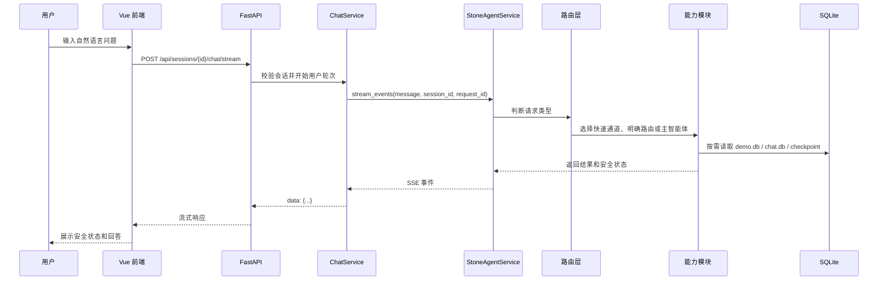

# 项目调用链说明

本文面向代码阅读和面试讲解，说明一次用户请求在前端、后端和 Agent 模块之间如何流转。

## 1. 用户发送问题后的完整调用链

## 2. Vue 如何请求 FastAPI

前端聊天页面位于 `frontend/src/features/chat/`：

- `ChatPage.vue` 负责页面布局和消息列表。
- `useChatSend.ts` 负责发送消息、处理 SSE 事件。
- `useMessageState.ts` 负责消息状态、回答解锁和历史消息归一化。
- `traceNarrative.js` 只把 trace 转换为白名单式安全状态。

当前轮思考正文只消费后端的 `thinking_delta`。`trace` 事件只更新结构化状态，不再把内部 trace steps 追加到 UI，避免重复展示和内部信息泄露。

## 3. FastAPI 如何调用 Agent

后端入口在 `src/backend/api/v1/chat.py`：

1. `ChatRequest` 校验用户输入。
2. `SessionService` 确认会话存在。
3. `DefaultChatService` 写入用户消息。
4. `StoneAgentService` 调用 `subagent.stone` 运行时。
5. 流式请求通过 SSE 返回 `thinking_delta`、`reply_delta`、`reply`、`done`。
6. 助手回答和安全 trace 写入 `chat.db`。

同步调用和流式调用都经过同一个 Agent 适配层，前端不直接接触 Agent 内部对象。

## 4. 快速通道、明确路由和主智能体判断

项目采用四层路由策略：

| 层级 | 场景 | 特点 |
|---|---|---|
| 元问题快速通道 | “你能做什么”“介绍系统工作流程” | 不调用模型，直接生成安全能力说明 |
| API 文档快速通道 | 明确接口文档查询 | 直接检索本地接口文档 |
| 明确数据库路由 | 高置信度数据库查询 | 直接走数据库能力，减少不必要的主智能体判断 |
| 主智能体判断 | 复杂、多意图或模糊问题 | 由主智能体选择合适能力并整理回答 |

这套策略的目标是：简单问题快、明确问题稳、复杂问题保留智能体弹性。

## 5. 子能力如何调用工具

每个能力模块位于 `src/subagent/stone/npi_*_agent/`，通过 `AGENT_SPEC` 注册：

- 数据库能力：只读查询演示业务库。
- API 文档能力：读取本地接口文档工具。
- 网页搜索能力：调用公开网页搜索工具。
- 图表能力：生成 Graphviz DOT，Graphviz 可用时渲染图片。

注册中心会发现这些能力，并用于路由、能力介绍和测试断言。

## 6. 三个数据库的区别

| 数据库 | 默认路径 | 作用 |
|---|---|---|
| 业务演示库 | `data/demo.db` | 存放订单、客户、商品、库存等示例业务数据 |
| 聊天会话库 | `data/chat.db` | 存放会话列表、用户消息、助手回答和安全 trace |
| Agent 状态库 | `data/agent_checkpoints.db` | 存放 LangGraph checkpoint，用于多轮上下文 |

三者分离可以让业务演示数据、前端会话历史和 Agent 内部状态互不污染。

## 7. 一次数据库查询经过哪些模块

以“数据库里有哪些表”为例：

1. Vue 发送 SSE 请求。
2. FastAPI 校验请求并写入用户消息。
3. 路由层识别为数据库查询。
4. 数据库能力读取 `demo.db`。
5. 后端把内部执行 trace 转成安全状态，例如“正在查询业务数据”。
6. 前端显示安全状态和最终表格/文本回答。
7. 会话历史写入 `chat.db`，Agent 多轮状态写入 `agent_checkpoints.db`。

## 8. 一次系统介绍问题经过哪些模块

以“介绍系统工作流程”为例：

1. Vue 发送 SSE 请求。
2. FastAPI 进入聊天服务。
3. 路由层命中元问题快速通道。
4. 能力说明从注册中心和 `AGENT_SPEC` 动态生成。
5. 后端返回数据库查询、接口文档、网页搜索、图表绘制四类能力和简要工作流程。
6. 不调用子能力，不展示内部 Agent 名、工具名或路由细节。

## 9. 为什么要做内部推理安全化

Agent trace 对调试有价值，但不适合直接展示给普通用户。项目当前普通 UI 只展示白名单状态：

- 正在分析问题
- 正在查询业务数据
- 正在检索接口文档
- 正在搜索网页信息
- 正在生成图表
- 正在整理结果

这样既保留用户可感知的进度，又避免暴露提示词、内部规则、工具参数和自由文本推理。
